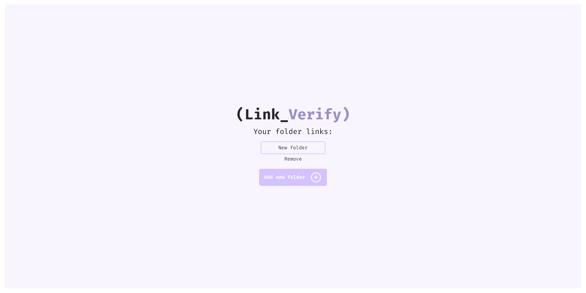

<div align="center">
  <h1>Link_verify</h1>
</div>

# Table of Contents

<!--ts-->
* [Project Description](#project-description)
* [Key Features](#key-features)
* [Technologies Used](#technologies-used)
* [How to Use](#how-to-use)
* [Contributing](#contributing)
* [Authors](#authors)
* [License](#license)
<!--te-->

## Project Description


**Link_verify** is a simple and effective application to check the validity of URLs. With this tool, you can easily verify if the links you have are active and accessible, saving time and ensuring a positive experience for users.

## Key Features

- Organize your URLs into folders.
- Add new URLs to your folders.
- Check the status of your URLs that are inside your folder.

## Technologies Used

- **Node.js and Express** for the backend.
- **Postgres** as the database.
- **React.js** for the frontend.
- **Apache** for the web server in Docker.
- **Docker** for faster setup for new users.

## How to Use

### Prerequisites

Before you begin, you will need to have the following tools installed on your machine: [Git](https://git-scm.com), [Node.js](https://nodejs.org/en/), [Docker](https://www.docker.com/).

### Installing the application

```bash
# Clone this repository
$ git clone github.com/GabrielLanzarini/links_verify

# Navigate to the project folder in the terminal/cmd
$ cd links_verify

# Navigate to the frontend folder in the terminal/cmd
$ cd frontend

# Install the dependencies
$ npm install

# Build the project
$ npm run build

# Navigate back to the backend folder
$ cd ..
$ cd backend

# Install the dependencies
$ npm install

# Navigate back to the root folder
$ cd ..

# Start the docker-compose
$ docker-compose up --build
```

## Contributing

Contributions are more than welcome! If you encounter a bug, have suggestions for improvements, or want to add new features, feel free to open an issue or send a pull request.

## Authors

This project was developed by:

- [Gabriel Henrique Antonelli Lanzarini](https://github.com/GabrielLanzarini).

## License

This project is licensed under the MIT License.

---

Thank you for using my links verifier! I hope this tool is useful for you. If you have any questions or need assistance, please don't hesitate to contact me!
